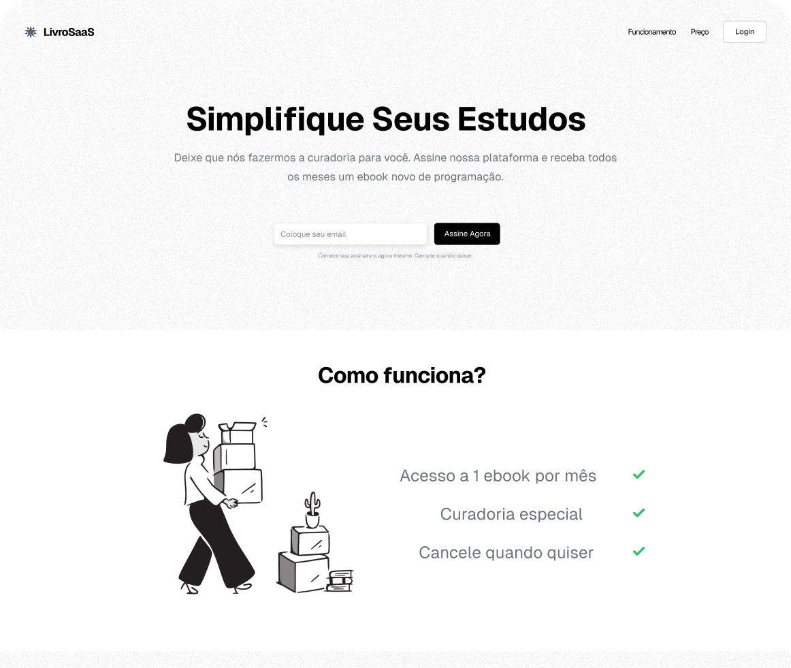

<h1 align="center">SaaS Landing Page </h1>

<div align="center">
   Solução para um desafio da <a href="https://codante.io" target="_blank">Codante.io</a>.
</div>

<div align="center">
  <h3>
    <a href="https://mp-saas-landing-page-com-nextjs-zeta.vercel.app/">
      Demo
    </a>
    <span> | </span>
    <a href="https://mp-saas-landing-page-com-nextjs-zeta.vercel.app/">
      Solução
    </a>
    <span> | </span>
    <a href="https://codante.io/mini-projetos/saas-landing-page-com-nextjs-e-shadcn-ui">
      Desafio
    </a>
  </h3>
</div>

## Tabela de Conteúdos

- [Tabela de Conteúdos](#tabela-de-conteúdos)
- [Visão Geral](#visão-geral)
  - [Construído Com](#construído-com)
- [Funcionalidades](#funcionalidades)
- [Como Usar](#como-usar)
- [Contact](#contact)

<!-- VISÃO GERAL -->

## Visão Geral



Esse projeto e de uma pagina estatica de um SaaS  simples com 4 seções:o cabeçalho, funcionamento, preços e o rodapé. Também adicionei uma animação no cabeçalho com o Framer Motion, e utilizei os  componentes ``Input`` e ``Button`` do e Shadcn/UI.

### Construído Com

- [Next.js](https://nextjs.org/)
- [Tailwind](https://tailwindcss.com/)
- [shadcn/ui](https://ui.shadcn.com/)
- Figma

## Funcionalidades

Esta site foi criado como uma submissão para um desafio do [Codante.io](https://codante.io/). O [desafio](https://codante.io/mini-projetos/saas-landing-page-com-nextjs-e-shadcn-ui) era construir uma aplicação que completasse os
requisitos fornecidas.

## Como Usar

Para clonar e rodar esta aplicação, você precisará ter [Git](https://git-scm.com) e [Node.js](https://nodejs.org/en/download/) (que vem com o [npm](http://npmjs.com)) instalados no seu computador. No seu terminal:

```bash
# Clone este repositório
$ git clone https://github.com/seu-usuario/seu-projeto

# Instale as dependências
$ npm install

# Rode a aplicação
$ npm start
```

## Contact

- Website [gleidsonfagno.com](https://www.gleidsonfagno.com.br/)
- GitHub [@your-username](https://{github.com/your-usermame})
- Linkedin [@Linkedin](https://www.linkedin.com/in/gleidson-fagno-1510a91ab/)
